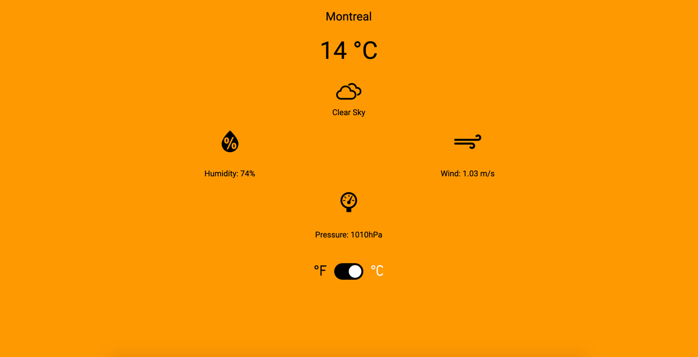

# Wazer

A Single Page web application built on Vue.js. Wazer shows your local weather information.

**Live Link**: [https://wazer.herokuapp.com/](https://wazer.herokuapp.com/)

## Table of contents

- [General info](#general-info)
- [Screenshots](#screenshots)
- [Technologies](#technologies)
- [Setup](#setup)
- [Status](#status)
- [Contact](#contact)

## General info

Wazer is built with Vue.js.

It calls two external apis to display your local weather information.

Calls to the apis are made to:

- [ipinfo.io](https://ipinfo.io)
- [OpenWeather]( https://api.openweathermap.org)

## Screenshots



## Technologies

- Vue.js - Version 2
- Axios - Version 0.21.1
- Node - Version 14
- NPM - Version 7

## Setup

After downloading the repository, install all dependencies with `npm install` and start the server with `npm run serve`.

See below other related commands.

The application use environment variables for the api keys to the different apis.

A _.env-sample_ file has been provided to you. Rename _.env-sample_ to _.env.local_

A .env.local file is not tracked in your repository.

In the _.env-sample_ file, you will find a line similar to this: `VUE_APP_GEO_TOKEN_API = YOUR_GEO_TOKEN_API_HERE`

Replace YOUR_GEO_TOKEN_API_HERE with your actual API Key so it becomes: `VUE_APP_GEO_TOKEN_API = 1234567890`

#### Project setup

```
npm install
```

#### Compiles and hot-reloads for development

```
npm run serve
```

#### Compiles and minifies for production

```
npm run build
```

#### Lints and fixes files

```
npm run lint
```

## Status

Project is: _finished_

## Contact

Created by Krishna Diamesso.
